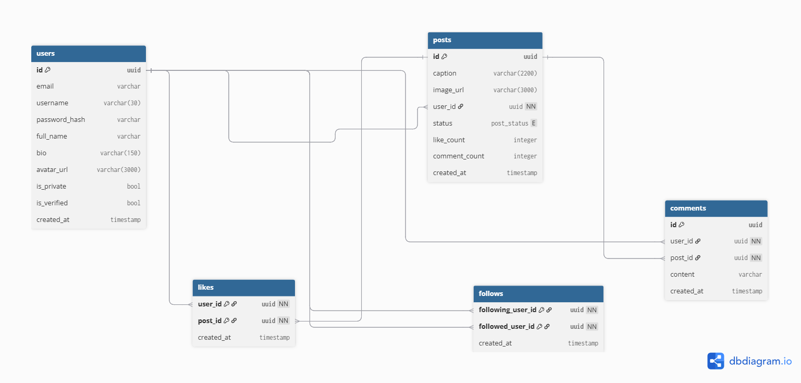

## Login LookUp
-- find a user by there email

SELECT * FROM users
WHERE email = 'email that we pass';

## Get user profile 
-- fetch a user's details by username

SELECT * FROM users 
WHERE username = 'required username';

## Get user's posts 
-- fetch all posts by a specific user

SELECT * FROM posts
WHERE user_id = (SELECT id FROM users WHERE username = 'required username');

## Get feed 
-- fetch posts from everyone a user follows

SELECT * FROM posts
WHERE user_id IN (
    SELECT followed_user_id FROM follows
    WHERE following_user_id = 'my user id'
)
ORDER BY created_at DESC;

## Check if already liked 
-- check if a user has already liked a specific post

SELECT * FROM likes
WHERE user_id = 'my user id'
AND post_id = 'the post id';